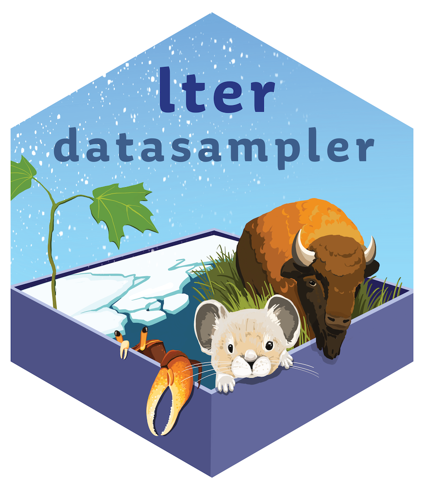
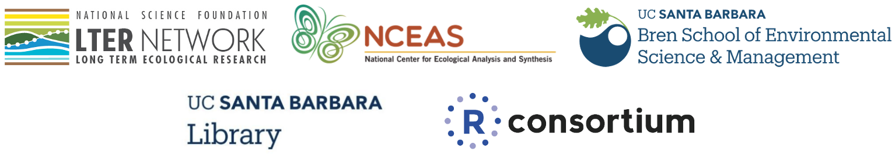

```{r setup, include=FALSE}
knitr::opts_chunk$set(
  collapse = TRUE,
  comment = "#>",
  fig.path = "man/figures/README-",
  out.width = "75%",
  warning = FALSE,
  message = FALSE,
  fig.retina = 2,
  fig.align = 'center'
)

library(gt)
library(tidyverse)
```

<!-- badges: start -->

[](https://github.com/lter/lterdatasampler/actions)
[](https://github.com/lter/lterdatasampler/actions)
[](https://cran.r-project.org/package=lterdatasampler)
[](http://www.r-pkg.org/pkg/lterdatasampler)


<!-- badges: end -->

# lterdatasampler <a href='https://lter.github.io/lterdatasampler/'></a>

The mission of the [Long Term Ecological Research program (LTER)
Network](https://lternet.edu/) is to “*provide the scientific community,
policy makers, and society with the knowledge and predictive
understanding necessary to conserve, protect, and manage the nation’s
ecosystems, their biodiversity, and the services they provide.*” A
specific goal of the LTER is [education and
training](https://lternet.edu/education-and-training/) - “*to promote
training, teaching, and learning about long-term ecological research and
the Earth’s ecosystems, and to educate a new generation of scientists.*”

The goal of this package is to provide a sampler to gather feedback from
the community of what will be a larger package containing 28 datasets -
one from each of the existing [US LTER
sites](https://lternet.edu/site/). Those datasets are subsets of the
original data and have been updated - sometimes substantially - from the
raw data. They are aimed to be useful for teaching and training in
environmental data science. **This content is thus not suitable for
research and should only be used for teaching purposes**.

We encourage you to explore existing LTER [teaching and training
initiatives](https://lternet.edu/education-and-training/), and the
**many** other available LTER datasets which can be accessed via the
[Environmental Data
Initiative](https://edirepository.org/). Please contact
cited researchers directly to discuss using data for research purposes
or in publication.

## Installation

You can install the CRAN version of `lterdatasampler` with:

``` r
install.packages("lterdatasampler")
```


You can install the development version of `lterdatasampler` from
GitHub with:

``` r
# install.packages("remotes")
remotes::install_github("lter/lterdatasampler")
```

## The dataset samples

Dataset samples currently included in the package are summarized below;
see individual Articles for data and source details. Note: the three
letter prefix for each dataset indicates the LTER site (see full list of
[site abbreviations](https://lternet.edu/site/)).

-   [`and_vertebrates`](https://lter.github.io/lterdatasampler/reference/and_vertebrates.html):
    Records for aquatic vertebrates (cutthroat trout and salamanders) in
    Mack Creek, Andrews Experimental Forest, Oregon (1987 - present)
-   [`arc_weather`](https://lter.github.io/lterdatasampler/reference/arc_weather.html):
    Daily meteorological (e.g. air temperature, precipitation) records
    from Toolik Field Station, Alaska (1988 - present)
-   [`hbr_maples`](https://lter.github.io/lterdatasampler/reference/hbr_maples.html):
    Sugar maple seedlings at Hubbard Brook Experimental Forest (New
    Hampshire) in calcium-treated and reference watersheds in August
    2003 and June 2004
-   [`knz_bison`](https://lter.github.io/lterdatasampler/reference/knz_bison.html):
    Bison masses recorded for the herd at Konza Prairie Biological
    Station LTER
-   [`luq_streamchem`](https://lter.github.io/lterdatasampler/reference/luq_streamchem.html):
    stream chemistry data for the Quebrada Sonadora (QS) location part of the Luqillo tropical
    forest LTER site
-   [`ntl_icecover`](https://lter.github.io/lterdatasampler/reference/ntl_icecover.html):
    Ice freeze and thaw dates for Madison, Wisconsin Area lakes (1853 -
    2019), North Temperate Lakes LTER
-   [`ntl_airtemp`](https://lter.github.io/lterdatasampler/reference/ntl_airtemp.html):
    Daily average air temperature data for Madison, Wisconsin (1869 -
    2019), North Temperate Lakes LTER
-   [`nwt_pikas`](https://lter.github.io/lterdatasampler/reference/nwt_pikas.html):
    Pika observations for habitat and stress analysis at Niwot Ridge
    LTER, Colorado
-   [`pie_crab`](https://lter.github.io/lterdatasampler/reference/pie_crab.html):
    Fiddler crab body size recorded summer 2016 in salt marshes from
    Florida to Massachusetts including Plum Island Ecosystem LTER,
    Virginia Coast LTER, and NOAA’s National Estuarine Research Reserve
    System

## Which data sample should I use?

These data samples are selected because they have features we feel are
commonly useful in introductory environmental data science and
statistics courses.

In the table below, we list some introductory methods / skills, then
share which data samples in this package we think are well-suited to use
when teaching or learning them! It is not comprehensive - there are
*many* different analyses & skills that these data samples would
facilitate. Here we highlight a few that we think would be commonly
useful

```{r, echo = FALSE}
# Create the table contents
table_contents <- tribble(
  ~method, ~datasample, ~data_description, ~link,
  "Linear relationships", "`pie_crab`", "Model the relationship between fiddler crab size and latitude using `pie_crab` , while learning about Bergmann's Rule!", "https://lter.github.io/lterdatasampler/articles/pie_crab_vignette.html",
  "Linear relationships", "`ntl_icecover`", "Investigate the relationship between winter temperatures and ice cover duration for Wisconsin lakes using `ntl_icecover`", "https://lter.github.io/lterdatasampler/articles/ntl_icecover_vignette.html",
  "Linear relationships", "`hbr_maples`", "Explore seedling height-mass relationships for sugar maples using `hbr_maples`", "https://lter.github.io/lterdatasampler/articles/hbr_maples_vignette.html",
  "Non-linear relationships", "`knz_bison`", "Model the relationship between bison age and mass for male and female bison using `knz_bison`, for example estimating parameters in the Gompertz model", "https://lter.github.io/lterdatasampler/articles/knz_bison_vignette.html",
  "Non-linear relationships", "`and_vertebrates`", "Model the length-mass relationships for cutthroat trout and salamanders in Mack Creek, Oregon", "https://lter.github.io/lterdatasampler/articles/and_vertebrates_vignette.html", 
  "Time series analysis", "`arc_weather`", "Explore seasonality, wrangling dates, or practice forecasting using daily meteorological records from Toolik Station, Alaska", "https://lter.github.io/lterdatasampler/articles/arc_weather_vignette.html", 
  "Time series analysis", "`luq_streamchem`", "Investigate the impact of a hurricane on stream water chemistry", "https://lter.github.io/lterdatasampler/articles/luq_streamchem_vignette.html",
  "Spatial data introduction", "`nwt_pikas`", "Introduce basics of spatial data (e.g. CRS, projections) and tools for working with spatial data by visualizing pika locations at Niwot Ridge in the Colorado Rockies", "https://lter.github.io/lterdatasampler/articles/nwt_pikas_vignette.html", 
  "Comparing groups", "`hbr_maples`", "Compare sugar maple seedling heights in previously calcium-treated versus untreated watersheds using `hbr_maples`, using the exercise as an opportunity to think about acid rain and soil acidification", "https://lter.github.io/lterdatasampler/articles/hbr_maples_vignette.html", 
  "Comparing groups", "`and_vertebrates`", "Explore differences in size and abundance of cutthroat trout and salamanders in old growth versus previously clear cut forest sections (2 groups) or in different conditions (> 2 groups, e.g. pool, cascade, riffle) of Mack Creek, Oregon", "https://lter.github.io/lterdatasampler/articles/and_vertebrates_vignette.html"
) %>% 
  mutate(full_link = sprintf('<a href = "%s">%s</a>', link, datasample),
         full_link = map(full_link, gt::html))


table_contents %>% 
  select(method, full_link, data_description) %>% 
  gt(groupname_col = "method") %>% 
  tab_header(
    title = "Recommended data samples for introducing selected topics",
  ) %>% 
  cols_label(method = "Topic", full_link = "Data sample", data_description = "For example you could:") %>%
  tab_options(row_group.as_column = TRUE) %>% 
  tab_style(
    style = "vertical-align:middle",
    locations = cells_row_groups()
  ) 
  
```

## How to provide feedback

The best way to provide feedback on this package is to open an
[issue](https://github.com/lter/lterdatasampler/issues) and assign the
`feedback` label. Thank you!

## Acknowledgements

Thank you to the amazing students who contributed to this project: *Sam
Guo, Adhitya Logan, Lia Ran, Sophia Sternberg, Karen Zhao* as part of
their [UCSB Data Science capstone
project](https://ucsb-ds-capstone-2021.github.io/projects/nceas/update3.html).
Thank you also go to their Course Advisor Prof. Sang-yun Oh.

People / organizations who supported this project:

-   LTER Network Office
-   LTER Information Managers
-   LTER Education Committee
-   All the LTER Researchers and Site PIs
-   Cyber-infrastructures:
    [EDI](https://edirepository.org/) and
    [DataONE](https://www.dataone.org/)

We gratefully acknowledge all authors and contributors of the
[`roxygen2`](https://roxygen2.r-lib.org/),
[`usethis`](https://usethis.r-lib.org/),
[`pkgdown`](https://pkgdown.r-lib.org/),
[`devtools`](https://devtools.r-lib.org/),
[`tidyverse`](https://www.tidyverse.org/) and
[`metajam`](https://github.com/NCEAS/metajam/) packages. This website
relies heavily on themes created by Dr. Desirée DeLeon and Dr. Alison
Hill.

<hr>


