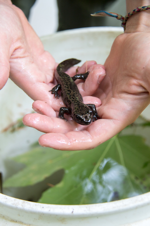

```{r, include = FALSE}
knitr::opts_chunk$set(
  collapse = TRUE,
  comment = "#>"
)
```

### Dataset sample used

- `and_vertebrates`

# Introduction

The `and_vertebrates` dataset contains length and weight observations for Coastal Cutthroat Trout and two salamander species (Coastal Giant Salamander, and Cascade Torrent Salamander) in previously clear cut (c. 1963) and old growth coniferous forest sections of Mack Creek in HJ Andrews Experimental Forest, Willamette National Forest, Oregon. For more information, visit the [data package on EDI](https://portal.edirepository.org/nis/mapbrowse?packageid=knb-lter-and.4027.14).

Forest harvesting can impact fish and vertebrate biomass, as described by Kaylor & Warren (2017). This data sample creates opportunities for learners to explore differences between vertebrate biomass and size in clear cut and old growth sections (each span 150 meters of creek) to investigate anthropogenic impacts on aquatic vertebrate populations. Further, the dataset provides opportunities to explore and model classic length-weight relationships for trout and salamanders.  

<figure style="text-align:center;">
  
  <figcaption>Coastal Giant Salamander at Mack Creek study site. Photo: Lina DiGregorio, from the Andrews Forest Photo Gallery (link below).</figcaption>
</figure>

See *many* more fantastic photos (Study site! Salamanders and trout being measured! and more!) from the Mack Creek vertebrates study at the HJ Andrews Experimental Forest [Photo Gallery](https://andrewsforest.oregonstate.edu/gallery/aquatic-vertebrate-population-study-mack-creek-2021)!

# Data exploration

```{r setup, message = FALSE, warning = FALSE}
library(lterdatasampler)
library(tidyverse)
```

The `and_vertebrates` data sample is in tidy format, containing 16 total variables (7 character, 8 numeric, 1 Date). Learn more about the variables in the data documentation (`?and_vertebrates`) and in the original [data package metadata](https://portal.edirepository.org/nis/metadataviewer?packageid=knb-lter-and.4027.14).

```{r}
glimpse(and_vertebrates)
```

## Exploring length-weight relationships

There is opportunity to explore and model the length-weight relationships for the three species (for example, using the standard length-weight relationship for fish: $W = aL^b$). Note: only 15 observations in the dataset are Cascade Torrent Salamanders (compared to 11,758 Coastal Giant Salamanders and 20,433 Coastal Cutthroat Trout). We omit Cascade Torrent Salamanders throughout this vignette. The `length_1_mm` variable is the total or snout-fork length for cutthroat trout (total length from 1987 - 1994; snout-fork length since 1995), and snout-vent length for salamanders (all in millimeters). 

```{r}
and_vertebrates %>% 
filter(species != "Cascade torrent salamander") %>% 
ggplot(aes(x = length_1_mm, y = weight_g)) +
  geom_point(aes(color = species)) +
  theme_minimal()
```

## Comparisons by section (clear cut or old growth)

The two sections in the dataset (CC = clear cut circa 1963, OG = upstream 500 year old growth coniferous forest) provide opportunity to explore differences in vertebrate biomass and abundance in the separate sections. Again, we omit Cascade Torrent Salamanders here due to the very small sample size (n = 15) relative to the other species.

### Vertebrate abundance by year and section

We can explore abundance (counts) of Coastal Cutthroat Trout and Coastal Giant Salamanders in clear cut (CC) and old growth (OG) forest sections of the creek.

```{r}
vert_counts <- and_vertebrates %>% 
  filter(species != "Cascade torrent salamander") %>% 
  drop_na(year, species, section) %>% 
  count(year, species, section)
ggplot(data = vert_counts, aes(x = year, y = n)) +
  geom_line(aes(color = section)) +
  geom_point(aes(color = section)) +
  theme_minimal() +
  facet_wrap(~species)
```

We can also explore the correlation in abundance (or biomass) in old growth and clear cut sections of the creek.

```{r}
vert_counts_wide <- vert_counts %>% 
  pivot_wider(names_from = section, values_from = n)

ggplot(data = vert_counts_wide, aes(x = CC, y = OG)) +
  geom_point() +
  theme_minimal() +
  facet_wrap(~species, scales = "free")
```


## Abundance and size by channel unit

The variable `unittype` contains channel unit classification (e.g. "cascade", "pool", "rapid", etc.). See the data sample documentation (`?and_vertebrates`) to see the other classification levels.

For example, just considering cutthroat trout, in which channel classification do they tend to be most abundant? 

```{r}
and_vertebrates %>% 
  filter(species == "Cutthroat trout") %>% 
  drop_na(unittype) %>% 
  count(unittype) %>% 
  mutate(unittype = fct_reorder(unittype, n)) %>% 
  ggplot(aes(y = unittype, x = n)) +
  geom_col() +
  theme_minimal()
```

We can see that for Coastal Cutthroat Trout, fish are most abundant in cascade (C), pool (P) and side channel (SC) habitats.

Then we might ask: for those three unit classifications (cascade, pool, and channel), how do cutthroat trout sizes compare? 

```{r}
and_vertebrates %>% 
  filter(species == "Cutthroat trout",
         unittype %in% c("C", "P", "SC")) %>% 
  ggplot(aes(x = length_1_mm)) +
  geom_histogram() +
  facet_wrap(~unittype, ncol = 1)
```


## Other things to explore

- Further explore differences in abundance, size and biomass for trout and salamanders by creek sections (previously harvested, or old growth) or channel unit classification (e.g. cascade versus pool)
- Use tag number (variable `pitnumber`) to explore growth of unique individuals
- Estimate parameters of the length-weight relationship for fish and salamanders

# Acknowledgements

Thank you to: original data collectors and researchers (see citation below), and Dr. Brooke Penaluna (Fish Biologist, HJ Andrews Experimental Forest Lead Scientist) for feedback and corrections!

# Citations

Kaylor, M.J. and D.R. Warren. 2017. Linking riparian shade and the legacies of forest management to fish and vertebrate biomass in forested streams. Ecosphere *8*(6). https://doi.org/10.1002/ecs2.1845

Gregory, S.V. and I. Arismendi. 2020. Aquatic Vertebrate Population Study in Mack Creek, Andrews Experimental Forest, 1987 to present ver 14. Environmental Data Initiative. https://doi.org/10.6073/pasta/7c78d662e847cdbe33584add8f809165 (Accessed 2020-10-09).

# How we processed the raw data

`r knitr::spin_child(here::here("data-raw","and_vertebrates_data.R"))`
