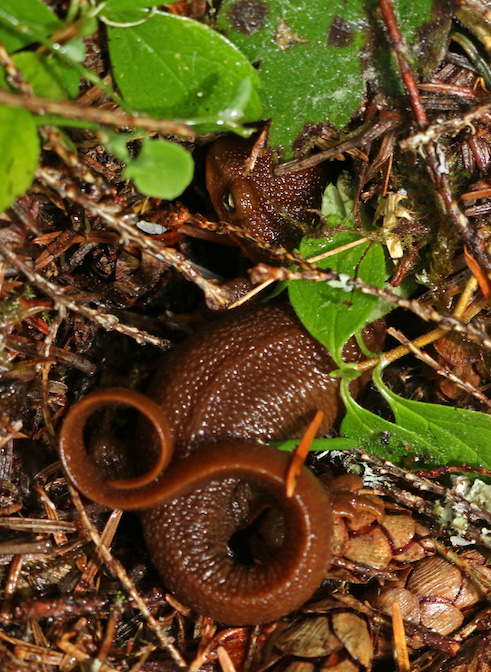

```{r setup, include = FALSE}
knitr::opts_chunk$set(
  collapse = TRUE,
  comment = "#>",
  message = FALSE,
  warning = FALSE
)
```

### Dataset sample used

- `and_vertebrates`

# Introduction

This data sample contains length and weight for West Slope cutthroat trout and two salamander species (Coastal giant salamander, and Olympic torrent salamander) in previously clear cut (c. 1963) and old growth coniferous forest sections of Mack Creek in HJ Andrews Experimental Forest in Willamette National Forest, Oregon. For more information, [see the data package on EDI](https://portal.edirepository.org/nis/mapbrowse?packageid=knb-lter-and.4027.14).


<figure style="text-align:center;">
  
  <figcaption>Erika Zambello, LTER CC BY-SA 4.0</figcaption>
</figure>


The data provides opportunities to explore length-weight relationships for three species observed, to compare biomass, abundance and sizes of species in old growth versus previously clear cut forest sections of the creek, and more.


# Data exploration

```{r}
library(lterdatasampler)
library(tidyverse)
```

## Exploring length-weight relationships

There is opportunity to explore and model the length-weight relationships for the three species (for example, using the standard length-weight relationship for fish: $W = aL^b$). 

Note: Olympic torrent salamanders are omitted throughout this vignette due to small sample size.

```{r}
and_vertebrates %>% 
filter(species != "Olympic torrent salamander") %>% 
ggplot(aes(x = length_1_mm, y = weight_g)) +
  geom_point(aes(color = species)) +
  theme_minimal()
```

## Comparisons by section (clear cut or old growth)

The two sections in the dataset (CC = clear cut circa 1963, OG = upstream 500 year old growth coniferous forest) provide opportunity to explore differences in vertebrate abundance and biomass in the separate sections.

### Vertebrate abundance by year and section

We can explore abundance (counts) of cutthroat trout and Coastal giant salamanders in clear cut (CC) and old growth (OG) forest sections of the creek.

```{r}
vert_counts <- and_vertebrates %>% 
  filter(species != "Olympic torrent salamander") %>% 
  drop_na(year, species, section) %>% 
  count(year, species, section)

ggplot(data = vert_counts, aes(x = year, y = n)) +
  geom_line(aes(color = section)) +
  geom_point(aes(color = section)) +
  theme_minimal() +
  facet_wrap(~species)
```

### Abundance correlation by section

We can explore the correlation in abundance (or biomass) in old growth and clear cut sections of the creek. 

```{r}
vert_counts_wide <- vert_counts %>% 
  pivot_wider(names_from = section, values_from = n)

ggplot(data = vert_counts_wide, aes(x = CC, y = OG)) +
  geom_point() +
  theme_minimal() +
  facet_wrap(~species, scales = "free")
```

## Abundance and size by channel unit

The variable `unittype` contains channel unit classification (e.g. "cascade", "pool", "rapid", etc.). See the data sample documentation (`?and_vertebrates`) to see the other classification levels.

For example, just considering cutthroat trout, in which channel classification do they tend to be most abundant? 

```{r}
and_vertebrates %>% 
  filter(species == "Cutthroat trout") %>% 
  drop_na(unittype) %>% 
  count(unittype) %>% 
  mutate(unittype = fct_reorder(unittype, n)) %>% 
  ggplot(aes(y = unittype, x = n)) +
  geom_col() +
  theme_minimal()
```

We can see that for cutthroat trout, fish are most abundant in cascade (C), pool (P) and side channel (SC) habitats.

Then we might ask: for those three unit classifications (cascade, pool, and channel), how do cutthroat trout sizes compare? 

```{r}
and_vertebrates %>% 
  filter(species == "Cutthroat trout",
         unittype %in% c("C", "P", "SC")) %>% 
  ggplot(aes(x = length_1_mm)) +
  geom_histogram() +
  facet_wrap(~unittype, ncol = 1)
```

Want to take your analysis further? Explore vertebrate biomass in clear cut and old growth sections, or by channel section. The [data package also contains a CSV with stream channel measurements](https://portal.edirepository.org/nis/mapbrowse?packageid=knb-lter-and.4027.14) like channel width and depth, which creates opportunities to explore relationships between habitat and vertebrate populations.

Have fun exploring the cutthroat trout and salamanders of Mack Creek in Andrews Forest! 

# Acknowledgements

# Citations

Gregory, S.V. and I. Arismendi. 2020. Aquatic Vertebrate Population Study in Mack Creek, Andrews Experimental Forest, 1987 to present ver 14. Environmental Data Initiative. https://doi.org/10.6073/pasta/7c78d662e847cdbe33584add8f809165

# How we processed the raw data

`r knitr::spin_child(here::here("data-raw","and_vertebrates_data.R"))`
