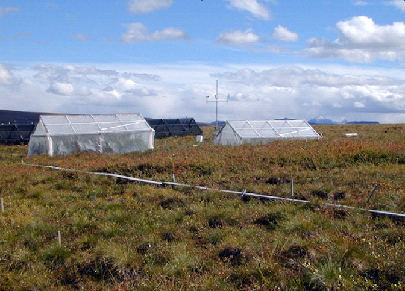

```{r, include = FALSE}
knitr::opts_chunk$set(
  collapse = TRUE,
  comment = "#>",
  rmarkdown.html_vignette.check_title = FALSE
)
```

### Dataset sample used 

- `arc_weather`

# Introduction

The `arc_weather` data sample contains selected meteorological records from the Toolik Field Station at Toolik Lake, Alaska, from 1988 - 2018. This data set offers opportunities to explore and wrangle time series data, visualize patterns (e.g. seasonality), and apply different forecasting methods. 

<figure style="text-align:center;">
  
  <figcaption>LTER research station Toolik Lake, LTER CC BY-SA 4.0</figcaption>
</figure>

# Data exploration

Attach required packages: 
```{r setup, message = FALSE, warning = FALSE}
library(lterdatasampler)
library(tidyverse)
library(tsibble)
library(feasts)
```

Here, we highlight daily air temperature (the data sample also contains records for precipitation and wind speed) using functions from the [`tsibble`](https://tsibble.tidyverts.org/) and [`feasts`](https://feasts.tidyverts.org/) R packages (both part of the fantastic [`tidyverts`](https://tidyverts.org/) ecosystem of "tidy tools for time series"). 

```{r}
# Calculate monthly average of daily mean air temperature and convert to tsibble: 
arc_weather_ts <- arc_weather %>% 
  mutate(yr_mo = yearmonth(date)) %>% # Make a column with just month and year from each date
  group_by(yr_mo) %>% # Group by year-month
  summarize(avg_mean_airtemp = mean(mean_airtemp, na.rm = TRUE)) %>% # Find monthly mean air temperature
  as_tsibble(index = yr_mo) # Convert to a tsibble (time series tibble)

# Check out the first 10 lines:
head(arc_weather_ts, 10)
```

Once the data are converted into a `tsibble` in the last line above, we can use helpful functions in `feasts` (like `autoplot()` and `gg_season()`) to explore the time series data a bit more. 

```{r}
# Create a line graph of monthly average of mean daily air temperatures:
arc_weather_ts %>% 
  autoplot(avg_mean_airtemp)
```

```{r}
# Create  season plot to explore seasonality: 
arc_weather_ts %>% 
  gg_season(avg_mean_airtemp)
```

We might want to decompose the time series data to further explore components. See Chapter 3 *Time series decomposition* in [Forecasting: Principles and Practice](https://otexts.com/fpp3/decomposition.html) by Rob J Hyndman and George Athanasopoulos for more information on decomposing time series data.  
```{r}
arc_weather_ts %>% 
  model(STL(avg_mean_airtemp)) %>% 
  components() %>% 
  autoplot()
```

We can also explore autocorrelation:
```{r}
arc_weather_ts %>% 
  ACF(avg_mean_airtemp) %>% 
  autoplot()
```

Then you can move on to time series forecasting and further analysis! Have fun with the `arc_weather` data sample from Arctic LTER. 

# Acknowledgements

# Citation

Shaver, G. 2019. A multi-year DAILY weather file for the Toolik Field Station at Toolik Lake, AK starting 1988 to present. ver 4. Environmental Data Initiative. https://doi.org/10.6073/pasta/ce0f300cdf87ec002909012abefd9c5c (Accessed 2020-07-04).

# How we processed the raw data

`r knitr::spin_child(here::here("data-raw","arc_weather_data.R"))`

