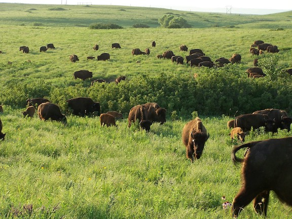
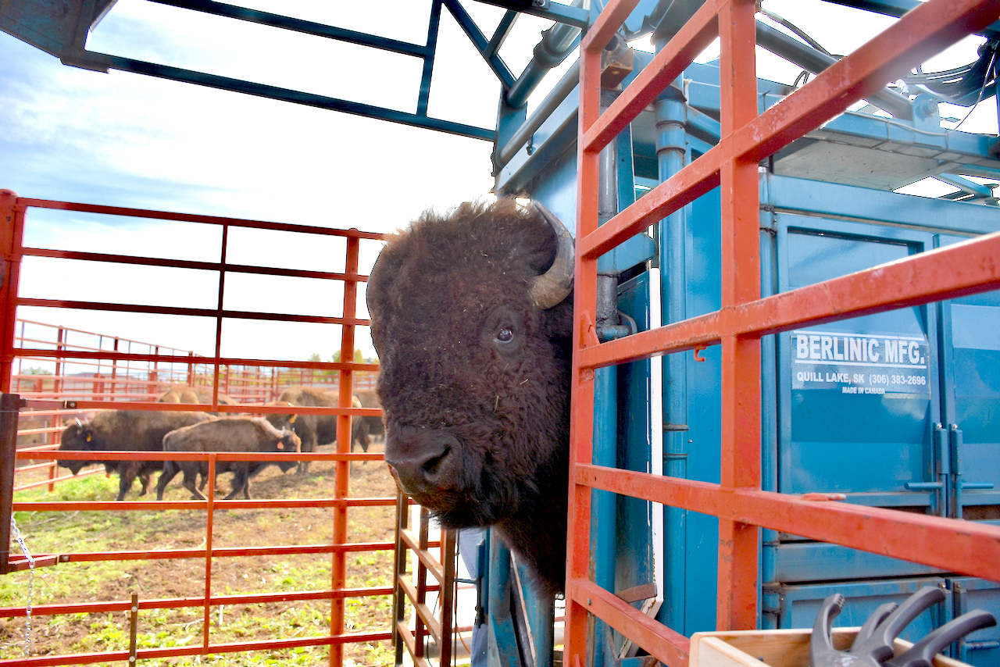

```{r, include = FALSE}
knitr::opts_chunk$set(
  collapse = TRUE,
  comment = "#>"
)
```

### Dataset sample used

- `knz_bison`

# Introduction

The `knz_bison` data provides age and weight records for the bison herd at [Konza Prairie Biological Station LTER](http://lter.konza.ksu.edu/konza-prairie-long-term-ecological-research-lter) (KPBS) in Kansas. 

The vignette highlights:

- An example of modeling bison weight (as a function of age) using the Gompertz model with `nls`
- Use of the `broom` package to tidy up outputs of `nls` for easier use

From Konza Prairie LTER Researcher Jeffrey Taylor: "Nearly 300 bison graze KPBS year-round without supplementary feed and with minimal human intervention, living as 'naturally' as possible. Bison were reintroduced in 1987, and collection of weight data began in 1994, making this dataset the longest continuous record of wild ungulate weight gain anywhere in the world. A round-up is conducted once annually at the end of the grazing season wherein each bison is weighed, calves are vaccinated and receive unique IDs, and excess individuals are culled." 

<figure style="text-align:center;">
  
  <figcaption>Konza Prairie LTER bison herd, LTER CC BY-SA 4.0</figcaption>
</figure>

<figure style="text-align:center;">
  
  <figcaption>Konza Prairie LTER bison in chute for data collection, LTER CC BY-SA 4.0</figcaption>
</figure>

<figure style="text-align:center;">
  
  <figcaption>Bison exiting chute following data collection, Konza Prairie LTER, LTER CC BY-SA 4.0</figcaption>
</figure>


# Data exploration

Attach required packages: 
```{r setup, message = FALSE, warning = FALSE}
library(lterdatasampler)
library(tidyverse)
library(broom)
```

Let's take a look at the existing `knz_bison` data sample:
```{r}
knz_bison
```

We can calculate each bison's age at observation by subtracting the year of birth (`animal_yob`) from the record year (`rec_year`), adding a new column called `animal_age` using `dplyr::mutate()`: 

```{r}

knz_bison_age <- knz_bison %>% 
  mutate(animal_age = rec_year - animal_yob)
```

Now, we'll explore bison weight as a function of age (in years), separated by sex:

```{r}
ggplot(data = knz_bison_age, aes(x = animal_age, y = animal_weight, group = animal_sex)) +
  geom_point(aes(color = animal_sex), 
             size = 0.5,
             position = position_jitter(width = 0.2, height = 0)) +
  labs(x = "Bison age (years)",
       y = "Recorded weight (pounds)") +
  scale_color_viridis_d() +
  theme_minimal()
```

# Gompertz model (with nonlinear least squares)

As used by Martin and Barboza (2020), bison body mass as a function of age can be modeled using a sex-specific Gompertz model: 

$$BM =b1*exp(-exp(-b2*(age-b3)))$$
Where $b1$ is the *asymptotic body mass* (pounds), $b2$ is instantaneous growth-rate at inflection point, and $b3$ is age at inflection point (years). 

Using nonlinear least squares (nls) to estimate $b1$, $b2$ and $b3$ requires starting estimates for each. We will use the following (based on visualizations above, and estimates from Supplemental Materials for Martin and Barbosa (2020): 

### Female bison parameter initial estimates: 

- $b1$ initial estimate: 1000 pounds
- $b2$ initial estimate: 1 
- $b3$ initial estimate: 0.6

## Create the Gompertz model function:

```{r}
gompertz <- function(b1, b2, b3, animal_age) {
  b1*exp(-exp(-b2*(animal_age-b3)))
}
```

## Use `nls()` to model growth for female bison

Isolate just the female bison (note that this starts from the dataset `knz_bison_age` created above that contains the calculated bison **age**, stored as `animal_age`): 
```{r}
bison_f <- knz_bison_age %>% 
  filter(animal_sex == "F")
```

Use `nls` to estimate parameters (note: add `trace = TRUE` to print iterative estimates): 
```{r}
bison_f_gompertz <- nls(animal_weight ~ gompertz(b1, b2, b3, animal_age),
                        data = bison_f,
                        start = list(b1 = 1000, b2 = 1, b3 = 0.6),
                        trace = TRUE)
```
## Plot the predicted masses with the observed data

```{r}
# Create a new series of ages
age_series <- seq(0, 22, by = 0.1)

# Make predictions using the model over those times: 
pred <- predict(bison_f_gompertz, list(animal_age = age_series))

# Bind the predictions and age sequence together into a data frame: 
bison_f_predicted <- data.frame(age_series, pred)

# Plot the observed data and predictions together:
ggplot() +
  geom_point(data = bison_f, 
             aes(x = animal_age, y = animal_weight),
             size = 0.3,
             alpha = 0.2) +
  geom_line(data = bison_f_predicted, 
            aes(x = age_series, y = pred),
            color = "darkorchid",
            size = 1) +
  theme_minimal()

```

# Explore & use model outputs with `broom`

The wonderful [`broom` package](https://broom.tidymodels.org/) "summarizes key information about models in tidy tibbles." For example, the `broom::tidy()` function summarizes important model information: 

```{r}
# Put model outputs into a tidy tibble: 
bison_f_gompertz_tidy <- bison_f_gompertz %>% broom::tidy()

# Check it out! 
bison_f_gompertz_tidy
```

We can also use the `broom::glance()` function to return important information about the model overall: 

```{r}
bison_f_gompertz %>% broom::glance()
```
We can use `broom::augment()` to added predicted values and residuals for each of the existing bison in the `bison_f` data frame: 

```{r}
augment(bison_f_gompertz)
```

**Note:** There are additional [related datasets for this data package](https://portal.edirepository.org/nis/metadataviewer?packageid=knb-lter-knz.78.12), containing information for the number of male and female bison per age category and bison maternal parentage (calves matched to mother by ear tags). We encourage you to check them out for more analysis opportunities with the Konza Prairie bison! 

# Acknowledgements

Thank you to Konza Prairie LTER Information Manager Yang Xia for reviewing this vignette and reaching out to researchers on the project, and to Konza Prairie LTER Researcher Jeffrey Taylor for providing photos and sharing additional information on the bison data.

# Citations

Blair, J. 2021. CBH01 Konza Prairie bison herd information ver 12. Environmental Data Initiative. https://doi.org/10.6073/pasta/9c641b35695abc5889edd64c3950517f (Accessed 2021-10-18).

Martin, JM and Barboza PS (2020). Decadal heat and drought drive body size of North American bison (Bison bison) along the Great Plains. Ecology and Evolution *10* (1): 336 - 349. https://doi.org/10.1002/ece3.5898.

Robinson, D, Hayes A and Couch S (2021). broom: Convert Statistical Objects into Tidy Tibbles. R package version 0.7.8. https://CRAN.R-project.org/package=broom


# How we processed the raw data

`r knitr::spin_child(here::here("data-raw","knz_bison_data.R"))`
