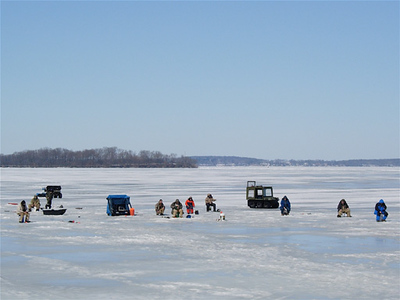

```{r, include=FALSE}
knitr::opts_chunk$set(
  collapse = TRUE,
  comment = "#>",
  message = FALSE, warning = FALSE,
  fig.width = 7,
  fig.height = 4
)

```

### Dataset sample used

- `ntl_icecover`
- `ntl_airtemp`


# Introduction

According to the [EPA](https://www.epa.gov/climate-indicators/climate-change-indicators-lake-ice#ref2), lake ice duration can be an indicator of climate change. This is because lake ice is dependent on several environmental factors, so changes in these factors will influence the formation of ice on top of lakes. As a result, the study and analysis of lake ice formation can inform scientists about how quickly the climate is changing, and are critical to minimizing disruptions to lake ecosystems. We can examine the ice duration of Lake Mendota, Lake Monona, and Lake Wingra, three lakes in the Madison, WI area.

<figure style="text-align:center;">
  
  <figcaption>North Temperate Lakes LTER study site, LTER CC BY-SA 4.0</figcaption>
</figure>

# Data Exploration

```{r setup}
library(lterdatasampler)
library(tidyverse)
```

## Ice Cover Data

```{r head}
head(ntl_icecover)
```

Note that the tidyverse also provides `glimpse()` for a quick view of a dataset:

```{r glimpse}
glimpse(ntl_icecover)
```

Now let's explore the data visually. We can explore the data distribution in the different lakes using a box plot

```{r box_plot}
lake_ice <-
  ggplot(data = ntl_icecover %>% filter(!is.na(ice_duration)), aes(x = lakeid, y = ice_duration)) +
  geom_boxplot(aes(color = lakeid, shape = lakeid),
               alpha = 0.8,
               width = 0.5) +
  theme_minimal() +
  labs(
    title = "Ice Duration of Lakes in the Madison, WI Area",
    y = "Ice Duration (Days)",
    x = "Lake",
    subtitle = "North Temperate Lakes LTER"
  ) +
  geom_jitter(
    aes(color = lakeid),
    alpha = 0.5,
    show.legend = FALSE,
    position = position_jitter(width = 0.2, seed = 0)
  )

lake_ice
```

Now let's have a look at the time-series across the different lakes:

```{r ice_duration}
ice_duration <-
  ggplot(data = ntl_icecover, aes(x = year)) +
  geom_line(aes(y = ice_duration, color = lakeid), alpha = 0.7) +
  theme_minimal() +
  labs(x = "Year", y = "Ice Duration (Days)", title = "Ice Duration of Lakes in the Madison, WI Area", subtitle = "North Temperate Lakes LTER")

ice_duration
```

Box plots and time series plots reveal similarities across the 3 lakes. What does the trend look like for *average* ice cover duration in the region, based on data for the 3 lakes here?

Boxplot (3-lake average):

```{r ntl_icecover_avg}
ntl_icecover_avg <- ntl_icecover %>%
  drop_na(ice_duration) %>% 
  group_by(year) %>%
  summarise(ice_duration = mean(ice_duration)) %>%
  rename(avg_ice_duration = ice_duration)

ntl_icecover_avg
```

Time Series Plot:

```{r ice_avg_time}
avg_ice_duration <-
  ggplot(data = ntl_icecover_avg %>% filter(!is.na(avg_ice_duration)), aes(x = year, y = avg_ice_duration)) +
  geom_line(alpha = 0.7) +
  theme_minimal() +
  geom_smooth(
    method = lm,
    se = FALSE,
    color = "blue",
    linetype = "dashed"
  ) + 
  labs(y = "Ice Duration (Days)", x = "Year", title = "Average Ice Duration", subtitle = "North Temperate Lakes LTER")

avg_ice_duration
```

The average ice duration in Madison is decreasing. What environmental factors are influencing this change?

[Research](http://hpkx.cnjournals.com/uploadfile/news_images/hpkx/2019-03-14/s41558-018-0393-56789.pdf) suggests that mean annual temperature is one of the primary factors that alter lake ice formation. We can look at the temperature data of Madison, WI found in `ntl_airtemp` to see if there is a corresponding change in climate that may have influenced the change in ice duration.

*Note that according to the original metadata: "Daily temperature data prior to 1884 were estimated from 3 times per day sampling and biases are expected and should not be comparable with data after that time."*

## Air Temperature Data

```{r ntl_airtemp}
head(ntl_airtemp)
```

Compute the mean annual temperature:

```{r avg_temp}
ntl_airtemp_avg <- ntl_airtemp %>% 
  group_by(year) %>% 
  summarise(ave_air_temp_adjusted = mean(ave_air_temp_adjusted))

ntl_airtemp_avg
```
Time Series Plot:

```{r temp}
temp_plot <-
  ggplot(data = ntl_airtemp_avg %>% filter(!is.na(ave_air_temp_adjusted)),
         aes(x = year, y = ave_air_temp_adjusted)) +
  geom_line(alpha = 0.7) +
  theme_minimal() +
  geom_smooth(
    method = lm,
    se = FALSE,
    color = "blue",
    linetype = "dashed"
  ) +
  labs(y = "Temperature", x = "Year", title = "Mean Annual Temperature in Madison, WI", subtitle = "North Temperate Lakes LTER")

temp_plot
```

There seems to be a general upward trend in the mean annual temperature. As a result, there may be a relationship between temperature and ice duration.


# Join and Compare Ice and Temperature Data

To compare the ice cover and temperature data directly, the `ntl_airtemp` and `ntl_icecover` datasets can be joined. In this case, the datasets can be joined by the common **year** variable. Since there is one temperature for each year in `ntl_airtemp_avg`, each temperature will be mapped to the corresponding year in the joined table.

```{r full_join}
ntl_joined_avg <- ntl_icecover_avg  %>% 
  left_join(by = "year", ntl_airtemp_avg)

ntl_joined_avg
```

Plot the average air temperature against the average ice cover duration:

```{r scatter}
scatter <-
  ggplot(data = ntl_joined_avg %>%
           filter(!is.na(ave_air_temp_adjusted) &
                    !is.na(ice_duration)),
         aes(y = avg_ice_duration, x = ave_air_temp_adjusted)) + geom_point(alpha = 0.8) +
  theme_minimal() +
  labs(
    title = "Air Temperature and Ice Duration of Lakes in Madison, WI",
    y = "Ice Duration (Days)",
    x = "Temperature (Celsius)",
    subtitle = "North Temperate Lakes LTER"
  ) +
  geom_smooth(
    method = "lm",
    color = "black",
    se = FALSE,
    size = 0.3
  )

scatter
```

It appears that there is a negative correlation between the mean annual temperature and the amount of time that each lake was frozen. This means that as temperature increases, the ice duration decreases.

To compare the temperature with the ice duration on a time-series plot, calculate the percent change in ice duration and temperature from the earliest data point for both variables. The earliest year of observation for ice duration was 1851, and the earliest year of observation for temperature was 1869. These values can be determined from the `ntl_icecover_avg` and `ntl_airtemp_avg` values calculated earlier. First, join the full dataset with the average ice duration data that we calculated earlier, and then add new columns containing the calculated percent changes.

```{r comparison}
# Remove data prior to 1868
ntl_joined_avg <- ntl_joined_avg  %>% 
  filter(year > 1868)


# Calculate the percent change
pct_change <- ntl_joined_avg %>%
  mutate(
    pct_change_ice = (avg_ice_duration / first(avg_ice_duration) - 1) * 100,
    pct_change_temp = (ave_air_temp_adjusted / first(ave_air_temp_adjusted) - 1) * 100
  ) 

```

Then plot a time series to compare the magnitude in changes in temperature and ice duration. Use the `pivot_longer` function so that both lines can easily be plotted on the same axes.

```{r pivot}
comparison_df <- pct_change  %>% 
  select(year, pct_change_temp, pct_change_ice) %>% 
  pivot_longer(cols = c(pct_change_ice, pct_change_temp)) 
```

Time Series Plot:

```{r comparison_plot}
comparison_plot <-
  ggplot(data = comparison_df ,
         aes(x = year, y = value, color = name)) +
  geom_line() +
  theme_minimal() +
  labs(x = "Year", y = "Percent Change", title = "Percent Change in Ice Duration and Temperature (from 1859 values)", subtitle = "North Temperate Lakes LTER")

comparison_plot
```

It appears that the change in ice somewhat mirrors the change in temperature each year, as several spikes in temperature have a corresponding dip in ice duration. This may indicate a relationship between the two variables that would be worth further investigation.

## Other things to explore: 

- How does interpretation change with different methods / visualizations of smoothing (e.g. moving average)
- Predictions of ice cover duration in the future
- Comparison of how those predictions change if you pick a longer or shorter dataset (e.g. how does the coefficient compare if you use all of the data, versus just data since ~1975?)


# Citation

Anderson, L. and D. Robertson. 2020. Madison Wisconsin Daily Meteorological Data 1869 - current ver 32. Environmental Data Initiative. https://doi.org/10.6073/pasta/e3ff85971d817e9898bb8a83fb4c3a8b (Accessed 2021-03-08).

Magnuson, J.J., S.R. Carpenter, and E.H. Stanley. 2021. North Temperate Lakes LTER: Ice Duration - Madison Lakes Area 1853 - current ver 35. Environmental Data Initiative. https://doi.org/10.6073/pasta/ab31f2489ee436beb73fc8f1d0213d97 (Accessed 2021-03-08).

# How we processed the raw data

## Ice Cover
`r knitr::spin_child(here::here("data-raw", "ntl_icecover_data.R"))`

## Air Temperature
`r knitr::spin_child(here::here("data-raw", "ntl_airtemp_data.R"))`

