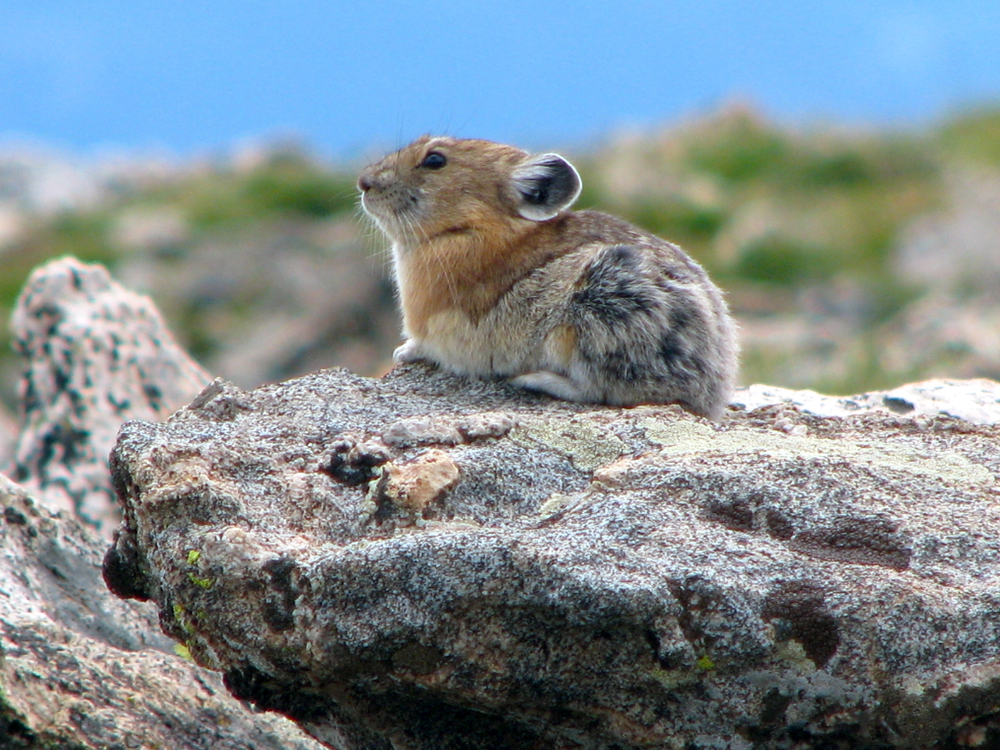

```{r, include = FALSE}
knitr::opts_chunk$set(
  collapse = TRUE,
  comment = "#>",
  fig.width = 7,
  fig.height = 4,
  message = FALSE, warning = FALSE
)
```

### Dataset sample used

- `nwt_pikas` 


# Introduction

Researchers at the Niwot Ridge Long Term Ecological Research Site (NWT LTER) seek to study and monitor the health of the Colorado Rockies over time. Because of external factors like climate change, it's more important than ever for scientists to understand how and why the Rockies are changing. Additionally, the well-being of the Rockies is crucial to local communities like Boulder, Colorado.


<figure style="text-align:center;">
  
  <figcaption>LTER researcher releasing a pika at the Niwot site, LTER CC BY-SA 4.0</figcaption>
</figure>

<br>

The American pika (Ochotona princeps) is a key species present at the NWT LTER. Despite their small size, pikas can be very informative about the health of the ecosystem. If pikas are more stressed, it can suggest that their habitat has declined in quality. As a result, the study of pikas is critical to the Colorado Rockies ecosystem. 

**Fun Facts:**

1. Pikas redigest their poop to help fully break down plant material and extract as many nutrients from it as possible. The first poop is very soft, the second is a hard pellet about the size of a black peppercorn. Only pellets were collected in this study.
2. Pikas stay active through the winter and eat grass and flowering plants that they cached during the summer. If you find a pikas food cache you are very likely to find poop nearby.

# Data Exploration

```{r setup}
library(lterdatasampler)
library(tidyverse)
library(ggmap)
library(sf)
library(leaflet)
```

Let's explore some stress data about pikas:

```{r head}
head(nwt_pikas)
```

Not only do we have stress measurements, but the `utm_easting` and `utm_northing` columns also provide the geographic coordinates of the sampling stations where fecal pellets were collected by researchers. It was from these fecal pellets that stress measurements were taken.

Geographical plotting can be helpful in our analyses. Generally speaking, it can offer a different perspective on our data and can also be easily understood by others. This is key; communicating results is an important part of data science.


# Converting to Simple Features

To leverage the geospatial features of our data, we can use the [`sf`](https://r-spatial.github.io/sf/index.html) package to transform the location information, currently stored in two columns, into information we can leverage for mapping and geospatial analysis. Using `sf`, we can represent our data as simple feature objects in R. As described in the `sf` package [documentation](https://r-spatial.github.io/sf/articles/sf1.html), simple features is a set of standards for describing how geographical data should be expressed digitally. This will allow us to use our data with various other geographical frameworks and standards, like mapping packages, GIS software, and GDAL, all of which use the simple features standard. You can work with simple features like lines and polygons, but we'll be working with point data.

First, we need to convert our current coordinates into an `sf` object. We can use the `st_as_sf()` function to do this:

```{r sf}
pikas_sf <- st_as_sf(x = nwt_pikas, coords = c("utm_easting", "utm_northing"))
head(pikas_sf %>% select(geometry))
st_crs(pikas_sf)
```

## Coordinate Reference Systems

We now have a geometry column consisting of points instead of two separate columns for our coordinates. However, there is still no Coordinate Reference System (CRS) associated with our points. A Coordinate Reference System describes several things about your data: how the Earth’s 3D surface is represented in a 2D form (spatial projection), how the Earth's shape is modeled (datum), the units, and the axes ([here](https://www.earthdatascience.org/courses/earth-analytics/spatial-data-r/intro-to-coordinate-reference-systems/) for more). 

From the data documentation (also known as metadata), which can be viewed by running `?nwt_pikas`, we can see that our measurements use the Universal Transverse Mercator (UTM) system, are in Zone 13, and use the NAD83 datum. These all describe the CRS that our data uses.

We can set the coordinate reference system of the geometry column using `st_set_crs()`. This can be done in two ways. You can either use a string to describe the coordinate system using PROJ4 syntax:

```{r proj4, eval=FALSE}
pikas_sf <-
  st_set_crs(pikas_sf, "+proj=utm +zone=13 +datum=NAD83 +units=m")
```

Or you can use the equivalent EPSG code:

```{r epsg}
pikas_sf <- st_set_crs(pikas_sf, 26913)
```

[epsg.io](https://epsg.io) can help you find the appropriate PROJ4 syntax and EPSG code for the appropriate coordinate system.

## Reprojecting Coordinates

Online map tiles used as map background often use the WGS84 Web Mercator coordinate system (also used by the [GPS system](https://en.wikipedia.org/wiki/Global_Positioning_System)), which uses a geographic coordinate system (latitude and longitude). After setting our CRS, we can reproject our data to the WGS84 CRS using `st_transform()` so that it's more compatible with third-party maps, which will give us more ways to represent our data:

PROJ4 Syntax:

```{r, eval=FALSE}
pikas_sf <- st_transform(pikas_sf, "+proj=longlat +datum=WGS84")
```

EPSG Code:

```{r}
pikas_sf <- st_transform(pikas_sf, 4326)
```


# Plotting Points

Now, we can plot our new data using `ggplot()` and `geom_sf()`.

```{r geom_sf}
pika_points <- ggplot(data = pikas_sf) + 
  geom_sf(aes(color = site, shape = site), alpha = 0.6) +
  theme_minimal() +
  labs(title = "Location of Pika Sampling Stations", subtitle = "Niwot Ridge LTER", x = "Latitude (Degrees)", y = "Longitude (Degrees)") +
  theme(axis.text.x = element_text(angle = 30)) # Tilts x-axis text so that the labels don't overlap

pika_points
```

Because we reprojected our data, we can now plot our data onto geographic maps.


# Incorporating Online Basemaps

Although it's cool to see these plots, we still don't have much geographical context for our data points, as we don't know the finer details of the area. One way we can add this to our plots is through the use of the [`ggmap`](https://github.com/dkahle/ggmap) package. `ggmap` allows us to plot static maps from places like [Google Maps](https://www.google.com/maps/) and [Stamen Maps](http://maps.stamen.com/#terrain/12/37.7706/-122.3782). `ggmap` is also easy to use in conjunction with `ggplot2`, making it possible to combine our plots from earlier with any maps produced with `ggmap`. Dr. Melanie Frazier at NCEAS has produced a [quick start guide](https://www.nceas.ucsb.edu/sites/default/files/2020-04/ggmapCheatsheet.pdf) for `ggmap` that can help you begin.

## `ggmap` Terrain Maps

First, let's try to plot the general area surrounding the Niwot Ridge LTER. We'll use Stamen Maps since Google Maps requires users to register with Google to use their API. We need to create a bounding box consisting of the coordinates of the region that we would like to plot. This takes some trial and error, but [OpenStreetMap](https://www.openstreetmap.org/export) can help you obtain the coordinates that you need.

```{r bbox}
nwt <- c(left = -106, bottom = 39.8433, right = -105, top = 40.2339)
```

Next, we can use `ggmap()` and `get_stamenmap()` to plot our map. `get_stamenmap()` creates a ggmap raster object and is similar to the `get_map(source = "stamen")` function in the NCEAS quick start guide above. `ggmap()` will plot this ggmap raster object. We can specify the `bbox` argument as the `nwt` variable we defined earlier. The `zoom` argument determines the scale of the map, and will also take some trial and error to get right. 

Now we can combine our `ggmap()` and our `geom_sf()` plots:

```{r combined_map}
combined_map <- ggmap(get_stamenmap(nwt, zoom = 10, maptype = "terrain")) + 
 geom_sf(data = pikas_sf, inherit.aes = FALSE, aes(color = site, shape = site)) +
  theme_minimal() +
  labs(title = "Location of Pika Sampling Stations", subtitle = "Niwot Ridge LTER", x = "Longitude (Degrees)", y = "Latitude (Degrees)") +
   scale_color_manual(values = c("black","red","purple")) # Choosing colors to make sure points are visible

combined_map
```

Finally, adjust the bounding box and zoom to get a better look:

```{r zoom}
pikas_location <- c(left = -105.65, bottom = 40.04, right = -105.55, top = 40.1)
pikas_map <- ggmap(get_stamenmap(pikas_location, zoom = 13, maptype = "terrain")) + 
 geom_sf(data = pikas_sf, inherit.aes = FALSE, aes(color = site, shape = site)) +
  theme_minimal() +
  labs(title = "Location of Pika Sampling Stations", subtitle = "Niwot Ridge LTER", x = "Longitude (Degrees)", y = "Latitude (Degrees)") +
  scale_color_manual(values = c("black","red","purple")) # Choosing colors to make sure points are visible

pikas_map
```

Now we have a unified plot consisting of our data and a terrain map!

## Interactive maps

You can also use the `leaflet` package to produce interactive maps:

```{r leaflet}
leaflet() %>% 
  addTiles() %>% 
  addCircles(data = pikas_sf, label = ~station)
```

You can learn more about the `leaflet` package [here](https://rstudio.github.io/leaflet/). There is also a cheat sheet available [here](https://github.com/rstudio/cheatsheets/blob/master/leaflet.pdf).


# Learn more

Want to learn more about how iconic species, such as Pikas, help to create enthusiasm around citizen science? Read this story: https://lternet.edu/stories/pika-enthusiasts-unite-under-a-common-theme/ 

<br>

<figure style="text-align:center;">
  
  <figcaption>Adult pika at the Niwot site, Sara McLaughlin</figcaption>
</figure>

<br>

# Aknowledgement

Thank you to Ashley Whipple and Chris Ray for their inputs while developing this vignette. Thank you also go to Adhitya Logan for his extra work on this vignette.


# Citation

Whipple, A. and Niwot Ridge LTER. 2020. Physiological stress of American pika (Ochotona princeps) and associated habitat characteristics for Niwot Ridge, 2018 - 2019 ver 1. Environmental Data Initiative. https://doi.org/10.6073/pasta/9f95baf55f98732f47a8844821ff690d (Accessed 2021-05-06).


# How we processed the raw data
`r knitr::spin_child(here::here("data-raw", "nwt_pikas_data.R"))`
